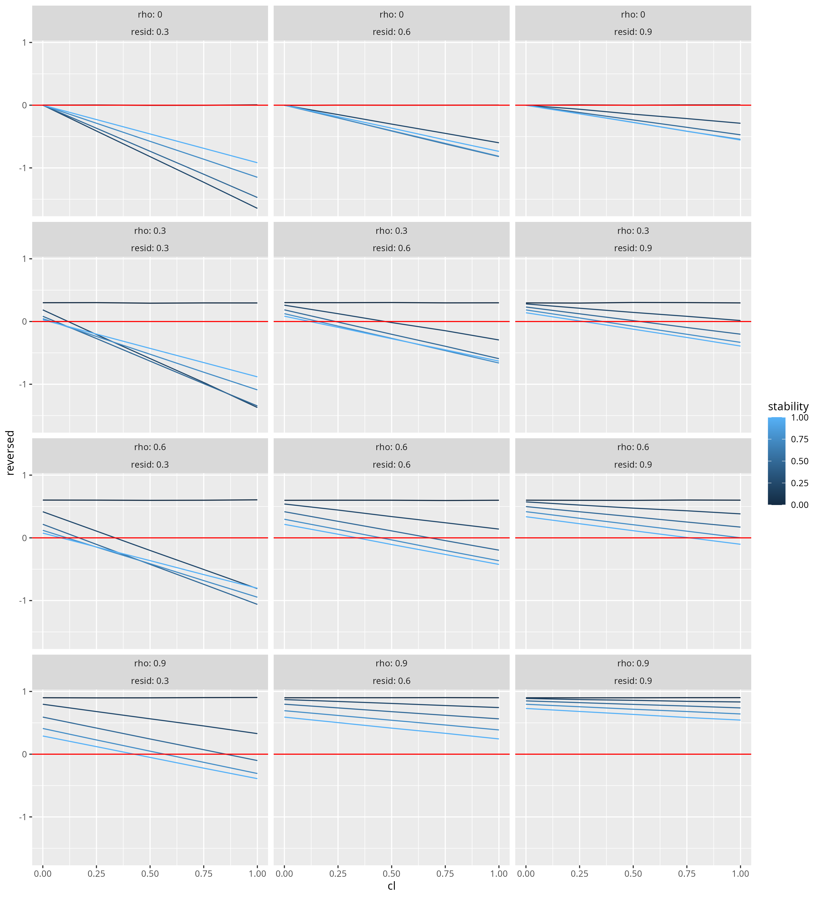
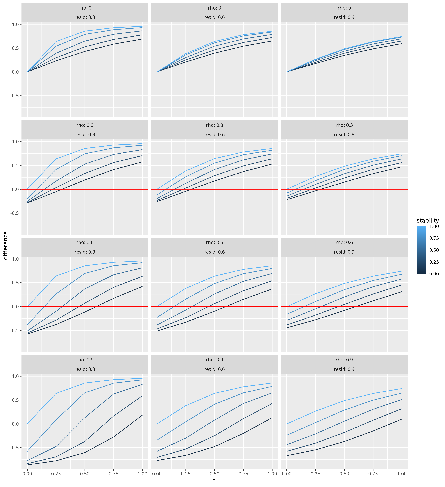

# clpm_triangulation

Sorjonen, Arhsamian, Lager, Nilsonne, and Melin (2024; [https://doi.org/10.31234/osf.io/ztwy6](https://doi.org/10.31234/osf.io/ztwy6)) reported the results of an experiment that purports to show the validity of a method for detecting spurious causal effects in a cross-lagged panel model (CLPM). Specifically, in this and other papers, they argued that when testing the causal effect of a predictor (X1) on a later outcome (Y2) after controlling for a prior measure of the outcome (Y1) assessed at the same time as the predictor, one should expect a specific pattern of coefficients across a set of regression equations. Specifically, they proposed that:

* When predicting the later outcome (Y2) from the earlier predictor (X1) and the earlier measure of the outcome (Y1), the coefficient for the predictor should be positive. This is uncontroversial and matches the standard test in the CLPM. 
* When predicting the earlier measures of the outcome (Y1) from the predictor (X1) and the later measure of the outcome (Y2), the coefficient for the predictor should be negative. They argue that this is a critical test of spuriousness.
* When predicting the difference in the two measures of the outcome (Y2 - Y1) from the outcome, the coefficient should be positive. 

The code in this repository simulates data that could be analyzed with the cross-lagged panel model to examine when the authors predictions hold. 

The critical point of these simulations is this: The authors developed the logical of their model from situations where the predictor and initial measure of the outcome are uncorrelated (as they would be in a true experiment). However, the CLPM is not needed in this situation, as the simple effect of the predictor on the later outcome recovers the true causal effect. When the predictor and initial measure are correlated (as they are expected to be when the CLPM is used), then the authors' predictions for the pattern of coefficients that emerge with true causal effects often do not hold. 

The plot below shows the results of the simulations for the authors' second test. True causal effects of X1 on Y2 (varying in size) are specified in each simulation. The figure shows that there are many situations where this critical coefficient is positive, which the authors argue would signal a spurious effect. 

The simulations show that positive correlations in the reversal regression (which the authors propose signal spurious effects) are more likely to emerge:

* With stronger correlations between the predictor and initial measure of the outcome
* With weaker true causal effect
* With more residual variance in the outcome measures
* Typically with lower stability coefficients for the outcome (though this interacts with other factors)

The second plot shows the results of the simulations using the authors third test (the coefficient when regressing the difference between Y2 and Y1 on X1), which the authors propose should be positive for true causal effects. Again, many values are negative for plausible parameters, and the likelihood of a negative coefficient increases as the correlation between X1 and Y1 goes up. 

We believe that these simulations show that the authors' test is not diagnostic of true versus spurious causal effects. 

## Code

The code is included in [simulation.R](simulation.R). There is one function to generate data that varies in the critical parameters (correlation, stability, causal effect, and residual variance). There is a separate function to run the authors' proposed tests and to report the three critical coefficients. The code then runs a simulation that tests these coefficients for models that vary in the parameters of the data-generating models. The resulting plot shows results for a set of these parameters for their second test (which should be negative for true causal effects). This plot shows that this coefficient is often positive, even for true causal effects. 

